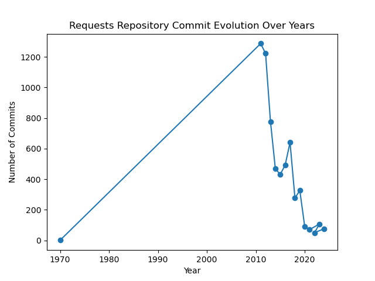

# 开源软件基础课设2025

*A simple yet elegant Analysis of Requests repository.*

## Quick Start

### Install Dependency

```bash
conda env create -f environment.yml
conda activate base
```

### Example Use

Adjust your personal token accordingly in data.py.

```python
python repo/comments.py
```


## Demo of Request Analysis Results

### Submit History





### Submit Characteristics


### Repository Evolution


